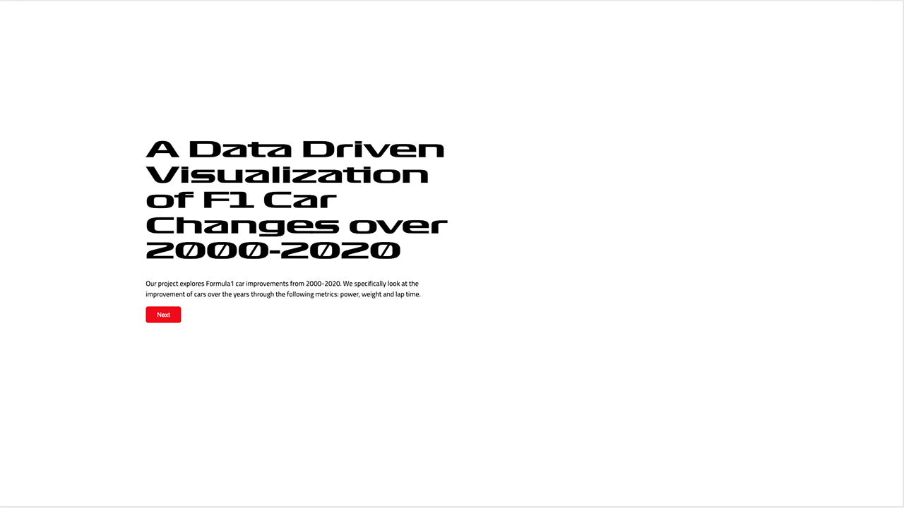

# A Data Driven Visualization of F1 Car Changes over 2000-2020

Please view this project in a `1920x1080` screen, on Chrome/Chromium.

## High Level Code Explanation

### Main
#### `main.js`:
Main "entry" file that contains the data loading, some required preprocessing, chart instantiation and also some global vars.

### Power and Weight/Mechanical Changes
Mechanical changes takes in data from `car_data.json` (loaded in the `main.js` promise).

#### `mechanicalChangesOverview.js`
The overview for section, it is a linechart with the x-axis of `years` and the y-axis of `average-power-to-weight-ratio.` Its structure should be familiar.

#### `mechanicalChangesSubOverview.js`:
This is the sub-overview/filtered scatterplot for mechanical changes -- it is given the title "Power-to-Weight of All F1 Cars from 2000 to 2020". Its x-axis is `power`, its y-axis `weight`.

The control flow is `initVis->updateVis->renderVis` and `updateVis->renderVis` when it needs to update.

It updates a global variable `mechanicalChangesSelectedGroup`, which is `{null|number}`. When it changes (registered through an `.on('click')` on a circle point) it'll call `updateVis` for the mechanical change charts.

#### `mechanicalChangesDetailView.js`
This is 2 stacked line charts that share an x-axis. The y-axes, in order, are `power` for "Power Progression for Selected Constructor, through the Years", and `powerToWeightRatio` for "Power-to-Weight Ratio Progression for Selected Constructor, through the Years". The x-axis is `years`. Because of the 2 y-axes, you will see that there are 2 of yScale and yAxis (differentiated by `Top` and `Bottom`).

In `updateVis`, we do 1 of 2 things:
1. If `mechanicalChangesSelectedGroup` variable, we update our "filteredData" and go to `renderVis`.
2. Otherwise, that means the `mechanicalChangesSelectedGroup` is null and we need to remove whatever lines that we have drawn (if any exist).

### LapTime0
#### `lapTime0.js`:
LT0 is a basic line chart with circle points. There is an interaction between LT0<->LT1 that is transferred between LT0 and LT1 through `lt0lt1SelectedYears`, which is an array of years (year is type `number`). There is also a clear and reset button that clear any selections on LT0 (and thus LT1) and reset brings back the default for LT0/LT1. 

### LapTime1
#### `lapTime1.js`:
LT1 is small multiples now, and uses a for-loop to create each small multiple. 

We append axes conditionally, based on the index of the for loop. If left most, it'll be `i % 5`, and so we append the y-axis tick values. If bottom, it'll be `i >= 30`, and we do x-axis ticks.

The `i===15` and `i===32` lines are to check which chart we are working on -- the `15` will append y-axis title, the `32`, x-axis.

There is also the `disableEnable` button which gets makes the points on the small multiples show/not show.

### LapTime2
#### `lapTime2Barchart.js`:

Suzuka is the default track. When another track is selected by `radio button` in `barchart`, it will update the `animation`

We use a stacked bar chart to show each sector in a track. A tool tip is also added to show the detail.

Whenever the `barchart` is updated, we update the `animation` as well.

#### `lapTime2AnimatedView.js`:

In `animated view`, it uses `selectedTrack` that's given by `radio button`. Suzuka Circuit is the default selected track. If another track is selected then it tries to find a track's svg file stored locally based on the `CircuitName` as the file name. Once it's found it gets appended to the space/container preallocated in `index.html`. Since we have to convert the svg map of a track manually, we limit the supported track to be 3 and it is guranteed that a map is available for sure

#### The `startLap` function
We always draw out the circuit geometry as backgroud and only start the animation when the start lap button is pressed

Once the start button is pressed, the mechanism behind the animation is that we break down the whole track into pieces, we have the transition and duration which is calculated from the fastest laptime -- the laptime in millisecond count is used for how long a lap takes.

Once a sector is finished, the event listener will call `updateAnimation` to start the next sector untill all three sectors are animated.

#### how svg file is constructed:
when we found it on wiki, it had extra marks besides the actual path, e.g. where to pit/break, etc., so we deleted all of that in text editor. Then, two offset paths are created so we have two "racing lines". Each of these racing line are further broken into sector lines. Finally, we changed id of the paths to "background", "sector1", etc.. for every file so d3 is able to selct it. We also scaled it using Adobe Illustrator as d3 scaling tools are not as robust and always scale from the origin.

### Utils
`utils.js`: This contains all of our shared utility/helper functions currently.
- `getMinuteStringFromMillisecond()`: This does the opposite of above.
- `chartTitle()`: This is a helper to append chart titles, it makes it a tiny bit quicker/saves some lines.
- `axisLabel()`: This is a helper to append axis labels, it also saves some lines.
- `getCircles()`: This is a helper to create circle points in the charts that require it, currently it is only used in LT0 and LT1 due to how it has been coded.
- `clearTooltip`: Helper to clear tool tip of any string, etc.
- `renderUtilLegend()`: Helper to render legend, only used in mechanical changes overview
